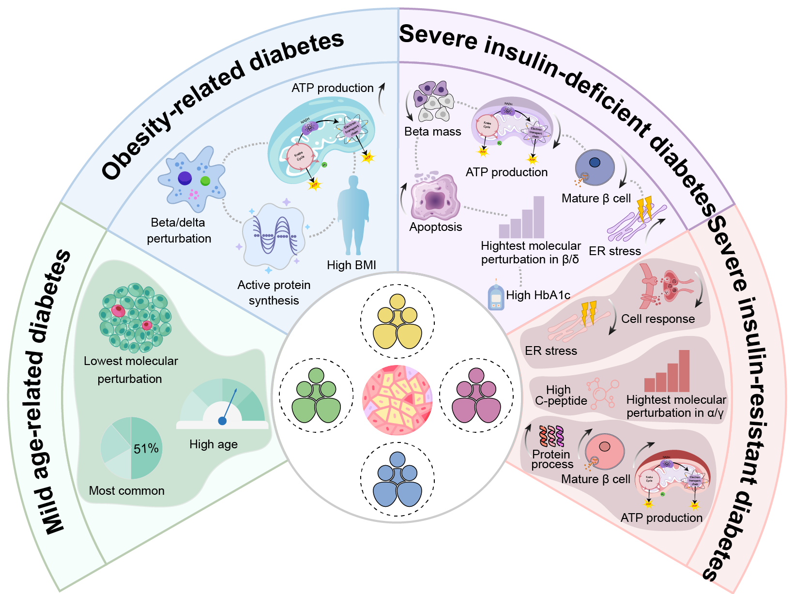

# Single-cell profiling of pancreatic islets reveals subtype-specific molecular perturbation landscape in type 2 diabetes

## Overview

This repository contains scripts to analysis data used to generate manuscript figures presented in our manuscript. Our study provides a comprehensive single-cell molecular landscape of pancreatic islets across 
various type 2 diabetes (T2D) subtypes, identifying specific molecular perturbations in severe insulin-deficient diabetes (SIDD), severe insulin-resistant diabetes (SIRD), mild obesity-related diabetes (MOD), and mild age-related 
diabetes (MARD) groups.

## Repository Structure

### `scripts/`
The analysis pipeline is organized by the corresponding figures in the manuscript:
* **`Preprocessing_for_scdata.r`**: Preprocessing of single-cell RNA-seq data.
* **`Figure1.r` / `Figure1.py`**: Analysis code used to generate Figure 1.
* **`Figure2.r`**: Analysis code used to generate Figure 2.
* **`Figure3.r`**: Analysis code used to generate Figure 3.
* **`Figure4.r`**: Analysis code used to generate Figure 4.
* **`Figure5.r`**: Analysis code used to generate Figure 5.

### `data/`
This folder contains the clinical metadata required for analysis:
* **`43_DonorDataForCluster.csv`**: Clinical information used for the initial clustering of T2D subtypes.
* **`ND_T2DAll_infor.csv`**: Comprehensive clinical details for all donors (ND and all four T2D subtypes).

## Raw Data
The raw single-cell RNA-seq datasets and clinical information used in this study were obtained from the **Human Pancreas Analysis Program (HPAP)** database: [https://hpap.pmacs.upenn.edu/](https://hpap.pmacs.upenn.edu/).

## Donor Metadata
Our study analyzed donor cohort from HPAP. The table below summarizes the donor distribution:

| Subgroup | Total Donors (Metadata) | Donors with scRNA-seq Data |
| :--- | :---: | :---: |
| **ND** (Normal Donor) | 18 | 9 |
| **MARD** (Mild Age-Related Diabetes) | 17 | 11 |
| **MOD** (Mild Obesity-Related Diabetes) | 13 | 8 |
| **SIDD** (Severe Insulin-Deficient Diabetes) | 10 | 3 |
| **SIRD** (Severe Insulin-Resistant Diabetes) | 3 | 1 |

## System Requirements
* **R Version**: >= 4.1.0.
* **Key R Packages**: `Seurat`, `ComplexHeatmap`, `clusterProfiler`, `Monocle2`, `Slingshot`, `ggplot2`, `dplyr`.
* **Python Version**: >= 3.8.
* **Key Python Packages**: `sklearn`, `seaborn`, `matplotlib`, `pandas`, `numpy`.
